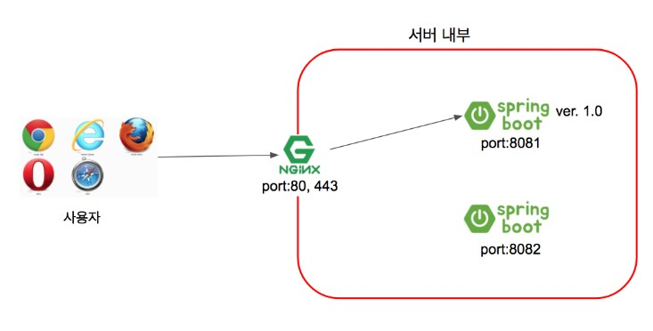
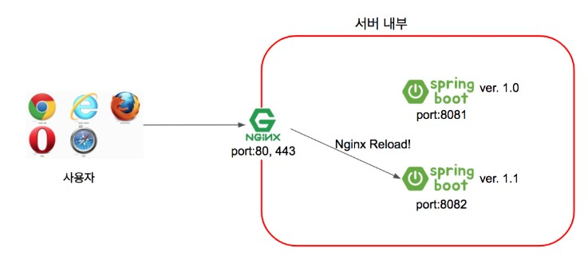
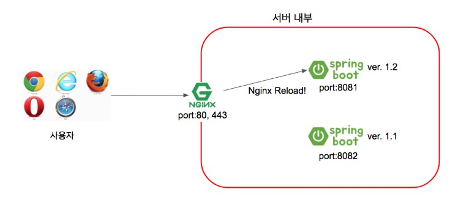
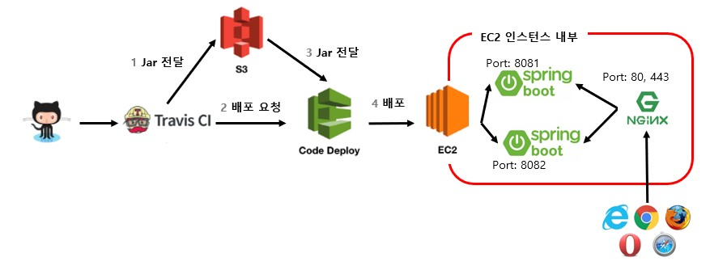

# 스프링부트2로 웹서비스 출시하기

## 06. AWS 생성 및 셋팅
1. 인스턴스 Amazon Linux AMI 선택
2. 스토리지 30GB
3. 태그 Name  springboot-aws-impl-alone 추가
4. 보안 그룹 추가 SSH 내IP, 사용자 지정 TCP 8080 추가
5. 키페어 생성 springboot-aws-impl-alone
6. 탄력적 IP 새주소 할당
7. 작업 - 주소연결

### EC2 접속하기

pem 키 .ssh 로 이동
```bash
cp pem.key ~/.ssh
chmod 600 ~/.ssh/pem.key
```

config 작성

```bash
vi ~/.ssh/config
```

```properties
# springboot-aws-impl-alonez
Host springboot-aws-impl-alone
    HostName ec2의 탄력적 IP 주소
    User ec2-user
    IdentityFile ~/.ssh/pem키 이름
```

퍼미션 옵션 변경
```bash
chmod 700 ~/.ssh/config
```

접속
```bash
ssh 서비스명
```

jdk 8 설치
```bash
sudo yum install -y java-1.8.0-openjdk-devel.x86_64
```

java 버전 8로 변경

```bash
sudo /usr/sbin/alternatives --config java
sudo yum remove java-1.7.0-openjdk
java -version
```

### 타임존 변경
```bash
sudo rm /etc/localtime
sudo ln -s /usr/share/zoneinfo/Asia/Seoul /etc/localtime
date
```

### Hostname 변경
```bash
sudo hostnamectl set-hostname springboot-aws-impl-alone
sudo reboot
```

/etc/hosts 에 HOSTNAME 등록
```bash
sudo vi /etc/hosts
```
```properties
127.0.0.1   springboot-aws-impl-alone
```

## 07. AWS RDS

MYSQL에서 MARIADB로 마이그레이션 해야 할 10가지 이유

MariaDB는 MySQL 대비 장점
- 동일 하드웨어 사양으로 MySQL보다 향상된 성능
- 좀 더 활성화된 커뮤니티
- 다양한 기능
- 다양한 스토리지 엔진

1. MariaDB 선택
2. 프리티어 선택
3. DB 인스턴스 식별자 - springboot-aws-impl-alone
4. 사용자 이름 암호 설정
5. 스토리지 범용(SSD) - 20
6. 퍼블릭 엑세스 가능 - 예
7. 초기 데이터베이스 이름 - springboot_aws_impl_alone

### RDS 운영환경에 맞는 파라미터 설정하기
- 타임존
- Character Set
- Max Connection

utf8과 utf8mb4의 차이는 이모지 저장 가능 여부

1. 파라미터 그룹 클릭
2. 파라미터 그룹 생성 클릭
3. 그룹이름, 설명 springboot-aws-impl-alone 입력 후 생성
4. 생성된 파라미터 편집 
    - time_zone - Asia/Seoul
    - character_set_client - utf8mb4
    - character_set_connection - utf8mb4
    - character_set_database - utf8mb4
    - character_set_filesystem - utf8mb4
    - character_set_results - utf8mb4
    - collation_connection - utf8mb4_general_ci
    - collation_server - utf8mb4_general_ci
    - max_connections - 150
5. 데이터베이스 선택 후 수정 클릭
    - DB 파라미터 그룹 위에 편집한 그룹 선택
    - 즉시 적용
    - 적용이 잘안되면 재부팅
6. VPC 보안 그룹 선택
    - MYSQL/Aurora 선택 ec2 보안 그룹 ID 복사해서 RDS 인바운드에 추가
    - MYSQL/Aurora 선택 인바운드에 내IP 추가
7. RDS 엔드포인트로 DB 접속

현재의 character_set, collation 설정 확인
```sql
show variables like 'c%'
```

변경이 안된 항목 직접 변경
```sql
ALTER DATABASE 데이터베이스명
CHARACTER SET = 'utf8mb4'
COLLATE = 'utf8mb4_general_ci'
```

타임 존 확인
```sql
select @@time_zone, now();
```

### EC2에서 RDS에서 접근 확인

EC2에 MySQL 접근 테스트를 위해 MySQL CLI 설치

```bash
sudo yum install mysql
```

RDS 접속
```bash
mysql -u 계정 -p -h Host 주소
mysql -u admin -p -h springboot-aws-impl-alone.caoklolkwzss.ap-northeast-2.rds.amazonaws.com
```

데이터베이스 목록 확인

```sql
show databases;
```

## 08. EC2 서버에 프로젝트를 배포해 보자
### EC2에 프로젝트 Clone 받기
```bash
sudo yum install git
git --version
mkdir ~/app && mkdir ~/app/step1
cd ~/app/step1
git clone https://github.com/freelife1191/springboot-aws-impl-alone.git
cd springboot-aws-impl-alone
```

테스트로 검증
```bash
./gradlew test
```

### 배포 스크립트 만들기
```bash
vi ~/app/step1/deploy.sh
```

scripts/step1_deploy.sh 내용 복사해서 붙여넣기


```bash
chmod +x ./deploy.sh
./deploy.sh
cat nohup.out
```

### 외부 Security 파일 등록하기

```bash
vi /home/ec2-user/app/application-oauth.yml
```

deploy.sh 수정

```bash
# 계속 구동될 수 있도록 nohup 로 구동
# -Dspring.config.location 스프링 파일 위치를 지정
# application-oauth.yml 은 외부에 파일이 있기 때문에 절대경로를 사용
nohup java -jar \
    -Dspring.config.location=classpath:/application.yml,/home/ec2-user/app/application-oauth.yml \
    $REPOSITORY/$JAR_NAME 2>&1 &
```

### 스프링 부트 프로젝트로 RDS 접근하기
- 테이블 생성
- 프로젝트 설정: MariaDB에서 사용 가능한 드라이버 추가
- EC2 설정: 서버 내부에서 접속 정보를 관리하도록 설정

1. 테스트 코드 수행 시 로그로 생성되는 쿼리를 사용하여 테이블 생성
2. File 검색(cmd + shift + O) 스프링 세션 테이블 생성 SQL schema-mysql.sql 파일 찾기
3. 서버에서 구동될 환경 설정파일 추가 src/main/resources/application-real.yml
4. app 디렉토리에 application-real-db.properties 파일 생성
5. nohup 스크립트 추가 수정
6. `curl localhost:8080` 테스트

### EC2에서 소셜 로그인하기
- AWS 보안 그룹 8080 열려있는지 확인
- AWS EC2 도메인으로 접속
   - 인스턴스의 퍼블릭 IPv4 DNS로 접속
- 구글에 EC2 주소 등록
- 네이버에 EC2 주소 등록
   - 서비스 URL
      - 로그인을 시도하는 서비스가 네이버에 등록된 서비스인지 판단하기 위한 항목
      - 포트는 제외하고 도메인만 입력
      - EC2 주소 등록시 localhost는 안됨
      - 개발 단계에서는 등록하지 않는 것을 추천
      - localhost도 하고 싶으면 네이버 서비스를 하나 더 생성해서 키를 발급
   
## 09. Travis CI 배포 자동화 - 코드가 푸시되면 자동으로 배포해 보자
마틴 파울러의 CI 4가지 규칙
- 모든 소스 코드가 살아 있고(현재 실행되고) 누구든 현재의 소스에 접근할 수 있는 단일 지점을 유지할 것
- 빌드 프로세스를 자동화해서 누구든 소스로부터 시스템을 빌드하는 단일 명령어를 사용할 수 있게 할 것
- 테스팅을 자동화해서 단일 명령어로 언제든지 시스템에 대한 건전한 테스트 수트를 실행할 수 있게 할 것
- 누구나 현재 실행 파일을 얻으면 지금까지 가장 완전한 실행 파일을 얻었다는 확신을 하게 할 것

### Travis CI 연동하기
깃허브에서 제공하는 무료 CI 서비스

Travis CI 웹서비스 설정

1. https://travis-ci.org 접속 후 계정명 -> Setting 클릭
2. Sync account 클릭
3. springboot-aws-impl-alone 깃허브 저장소 활성화

프로젝트 설정

1. .travis.yml 생성
2. push 후 travis 웹에서 확인

### Travis CI 와 AWS S3 연동하기
Travis CI 연동시 구조


1. AWS Key 발급
   - IAM - 사용자 - 사용자 추가
   - 사용자 이름 freelect-travis-deploy 기입
   - 프로그래밍 방식 엑세스 체크
   - 기존 정책 직접 연결 선택
   - AmazonS3FullAccess 체크
   - AWSCodeDeployFullAccess 체크
   - 태그 Name - freelect-travis-deploy 추가
2. Travis CI에 키 등록
   - Travis CI에서 More Options 클릭후 Settings
   - Environment Variables 에 AWS_ACCESS_KEY, AWS_SECRET_KEY 등록
3. S3 버킷 생성
   - 버킷 이름 freelect-springboot-build
   - 모든 퍼블릭 엑세스 차단 체크
4. .travis.yml 추가

### Travis CI와 AWS S3, CodeDeploy 연동하기
EC2에 IAM 역할 추가하기

- 역할
   - AWS 서비스에만 할당할 수 있는 권한
   - EC2, CodeDeploy, SQS 등
- 사용자
   - AWS 서비스 외에 사용할 수 있는 권한
   - 로컬 PC, IDC 서버 등

1. 역할 - 역할 만들기
2. AWS 서비스 - EC2 
3. AmazonEc2RoleforAWSCodeDeploy
4. 태그 본인이 원하는 이름으로 추가 ec2-codedeploy-role
5. 검토에서 마지막으로 역할의 이름을 등록하고 나머지 등록 정보를 최종적으로 확인

EC2 서비스에 등록

1. EC2 인스턴스 목록으로 이동
2. 마우스 우클릭 후 보안 -> IAM 역할 수정 - 생성한 역할 선택
3. 인스턴스 재부팅

CodeDeploy 에이전트 설치

1. EC2에 접속해서 입력해서 에이전드 다운로드

```bash
aws s3 cp s3://aws-codedeploy-ap-northeast-2/latest/install . --region ap-northeast-2
```

2. 실행권한 추가
```bash
chmod +x ./install
```

3. ruby 설치
   
```bash
sudo yum install ruby -y
```

4. install 파일로 설치 진행

```bash
sudo ./install auto
```

5. Agent가 정상적으로 실행되고 있는지 상태 검사

```bash
sudo service codedeploy-agent status
```

### CodeDeploy를 위한 권한 생성
CodeDeploy에서 EC2에 접근하려면 권한이 필요

1. AWS에서 IAM 역할 생성 역할 - 역할 만들기 - AWS 서비스 - CodeDeploy 선택
2. 태그 추가 Name - codedeploy-role 
3. 검토 역할 이름 codedeploy-role

### CodeDeploy 생성
- Code Commit
   - 깃허브와 같은 코드 저장소의 역할
   - 프라이빗 기능을 지원한다는 강점이 있지만 현재 깃허브에서 **무료로 프라이빗 지원**을 하고 있어서 거의 사용되지 않음
- Code Build
   - Travis CI와 마찬가지로 **빌드용 서비스**
   - 멀티 모듈을 배포해야 하는 경우 사용해 볼만하지만 규모가 있는 서비스에서는 대부분 젠킨스/팀시티 등을 이용하니 이것 역시 사용할 일이 거의 없음
- CodeDeploy
   - AWS의 배포 서비스
   - 앞에서 언급한 다른 서비스들은 대체재가 있지만 CodeDeploy는 **대체재가 없음**
   - 오토 스케일링 그룹 배포, 블루 그린 배포, 롤링 배포, EC2 단독 배포 등 많은 기능을 지원
   
1. CodeDeploy 서비스에서 애플리케이션 생성 버튼 클릭
2. 애플리케이션 이름 - springboot-aws-impl-alone EC2/온프레미스 선정택 후 생성
3. 배포 그룹 생성 버튼 클릭 
4. 배포 그룹 이름 입력 springboot-aws-impl-alone-group 
5. 서비스 역할 선택 codedeploy-role
6. 배포 유형 현재 위치 선택
7. 환경 구성 Amazon Ec2 인스턴스 체크
8. 키 Name , 값 springboot-aws-impl-alone 태그 추가
9. 배포 설정 - CodeDeployDefault.AllAtOnce
10. 로드 밸런싱 활성화 체크 해제
11. 배포 그룹 생성 완료

### Travis CI, S3, CodeDeploy 연동

Travis CI의 Build가 끝나면 S3에 zip 파일이 전송되고
zip 파일은 /home/ec2-user/app/step2/zip로 복사되어 압출을 풀 예정

Travis CI의 설정은 .travis.yml로 진행
AWS CodeDeploy의 설정은 appspec.yml로 진행

1. EC2 접속해서 디렉토리 생성

```bash
mkdir ~/app/step2 && mkdir ~/app/step2/zip
```

2. .travis.yml codedeploy deploy 스크립트 추가
3. .appspec.yml 파일 추가
3. 푸시 및 배포 테스트

### 배포 자동화 구성
1. deploy.sh step2 추가
2. .travis.yml 파일 before_deploy 스크립트 수정
3. appspec.yml 파일 수정
4. build.gradle version 업데이트

### 로그 확인

디렉토리 명은 CodeDeploy ID

로그 확인 디렉토리
```bash
cd /opt/codedeploy-agent/deployment-root
```

## 10. 24시간 365일 중단 없는 서비스를 만들자
무중단 배포 방식 2가지
- AWS에서 블루그린 무중단 배포
- 도커를 이용한 웹서비스 무중단 배포

리버스 프록시 - 외부의 요청을 받아 백엔드 서버로 요청을 전달하는 행위

구조 - 하나의 EC2 혹은 리눅스 서버에 Nginx 1대와 스프링 부트 Jar를 2대 사용
- 엔진엑스는 80(http), 443(https) 포트를 할당
- 스프링 부트1은 8081포트로 실행
- 스프링 부트2는 8082포트로 실행

### Nginx 무중단 배포 1



운영과정

1. 사용자는 서비스 주소로 접속(80 혹은 443)
2. Nginx는 사용자의 요청을 받아 현재 연결된 스프링 부트로 요청을 전달
    - 스프링 부트1 즉 8081 포트로 요청을 전달한다고 가정
3. 스프링 부트2는 엔진엑스와 연결된 상태가 아니니 요청을 받지 못함

### Nginx 무중단 배포1
 1.1 버전으로 신규 배포가 필요하면, Nginx와 연결되지 않은 스프링 부트2(8082 포트)로 배포



1. 배포하는 동안에도 서비스는 중단되지 않음
    - Nginx는 스프링 부트1을 바라보기 때문
2. 배포가 끝나고 정상적으로 스프링 부트2가 구동 중인지 확인
3. 스프링 부트2가 정상 구동 중이면 nginx reload 명령어를 통해 8081 대신에 8082를 바라보도록 한다
4. nginx reload는 0.1초 이내에 완료됨

### Nginx 무중단 배포3
1.2 버전 배포가 필요하면 이번에는 스프링 부트1로 배포



1. 현재는 Nginx와 연결된 것이 스프링 부트2
2. 스프링 부트1의 배포가 끝났다면 Nginx가 스프링 부트1을 바라보도록 변경하고 nginx reload를 실행
3. 이후 요청부터는 Nginx가 스프링 부트1로 요청을 전달

### 무중단 배포 전체 구조



## Nginx 설치와 스프링 부트 연동하기

1. Nginx 설치

```bash
sudo yum install nginx -y
# 아마존 리눅스2
sudo amazon-linux-extras install -y nginx1
```

2. Nginx 실행

```bash
sudo service nginx start
```

3. EC2 보안 그룹 추가
    - EC2 -> 보안 그룹 -> EC2 보안 그룹 선택 -> 인바운드 편집 -> 80번 포트 추가
4. 리다이렉션 주소 추가
    - 구글 로그인 인증과 네이버 로그인 인증 URL의 포트를 80으로 변경
5. 접속하여 Nginx 화면 확인

6. Nginx와 스프링 부트 연동

```bash
sudo vi /etc/nginx/nginx.conf
```

nginx.conf location 설정 추가
    - proxy_pass
        - Nginx로 요청이 오면 http://localhost:8080로 전달함
    - proxy_set_header XXX
        - 실제 요청 데이터를 header의 항목에 할당함
        - 
```
http {
    server {
        ...
        location / {
                proxy_pass http://localhost:8080;
                # IP에 요청자의 IP를 저장
                proxy_set_header X-Real-IP $remote_addr;
                proxy_set_header X-Forwarded-For $proxy_add_x_forwarded_for;
                proxy_set_header Host $http_host;
        }
        ...
    }
}
```

Nginx 재시작

```bash
sudo service nginx restart
systemctl status nginx.service
```

80 포트로 웹 접속 확인

### 무중단 배포 스크립트 만들기

1. profile API 추가
2. real1, real2 profile 생성
3. 엔진엑스 설정 수정

배포 때마다 Nginx의 프록시 설정(스프링 부트로 요청을 훌려보내는)이 순식간에 교체됨

프록시 설정이 교체될 수 있도록 설정을 추가

```bash
sudo vi /etc/nginx/conf.d/service-url.inc
```

다음 코드 입력

```
set $service_url http://127.0.0.1:8080;
```

저장하고 종료한뒤 nginx.conf 파일 열기

```bash
sudo vi /etc/nginx/nginx.conf
```

location / 부분을 찾아 변경

```
include /etc/nginx/conf.d/service-url.inc;

location / {
        proxy_pass $service_url;
        proxy_set_header X-Real-IP $remote_addr;
        proxy_set_header X-Forwarded-For $proxy_add_x_forwarded_for;
        proxy_set_header Host $http_host;
}
```

저장하고 종료한뒤 재시작

```bash
sudo service nginx restart
systemctl status nginx.service
```

4. 배포 스크립트들 작성

EC2에 step3 디렉토리를 생성

```bash
mkdir ~/app/step3 && mkdir ~/app/step3/zip
```

appspec.yml 의 destination 변경

```yaml
destination: /home/ec2-user/app/step3/zip/
```

무중단 배포 스크립트 5개
- stop.sh: 기존 Nginx에 연결되어 있진 않지만 실행중이던 스프링 부트 종료
- start.sh: 배포할 신규 버전 스프링 부트 프로젝트를 stop.sh로 종료한 'profile'로 실행
- health.sh: 'start.sh'로 실행시킨 프로젝트가 정상적으로 실행됐는지 체크
- switch.sh: Nginx가 바라보는 스프링 부트를 최신 버전으로 변경
- profile.sh: 앞선 4개 스크립트 파일에서 공용으로 사용할 'profile'과 포트 체크 로직

appspec.yml 의 hook 스크립트 추가 AfterInstall, ApplicationStart, ValidateServce

jar 파일이 복사된 이후부터 차례로 스크립트들이 실행됨

5. 무중단 배포 테스트

build.gradle 의 version 수정

여러 문법을 사용할 수 있는데 new Date()로 빌드할때마다 그 시간이 버전에 추가되도록 구성함

```groovy
version '1.0.1-SNAPSHOT-'+new Date().format("yyyyMMddHHmmss")
```

최종 코드를 깃 허브에 푸시하여 배포가 자동으로 진행되면 CodeDeploy 로그로 잘 진행되는지 확인

```bash
$ tail -f /opt/codedeploy-agent/deployment-root/deployment-logs/codedeploy-agent-deployments.log
[2021-01-01 07:46:02.862] [d-U9XUHMOK7]LifecycleEvent - AfterInstall
[2021-01-01 07:46:02.863] [d-U9XUHMOK7]Script - stop.sh
[2021-01-01 07:46:02.912] [d-U9XUHMOK7][stdout]> 8082 에서 구동중인 애플리케이션 pid 확인
[2021-01-01 07:46:02.953] [d-U9XUHMOK7][stdout]> 현재 구동중인 애플리케이션이 없으므로 종료하지 않습니다.
[2021-01-01 07:46:03.644] [d-U9XUHMOK7]LifecycleEvent - ApplicationStart
[2021-01-01 07:46:03.644] [d-U9XUHMOK7]Script - start.sh
[2021-01-01 07:46:03.658] [d-U9XUHMOK7][stdout]> Build 파일 복사
[2021-01-01 07:46:03.658] [d-U9XUHMOK7][stdout]> cp /home/ec2-user/app/step3/zip/*.jar /home/ec2-user/app/step3/
[2021-01-01 07:46:03.716] [d-U9XUHMOK7][stdout]> 새 어플리케이션 배포
[2021-01-01 07:46:03.719] [d-U9XUHMOK7][stdout]> JAR Name: /home/ec2-user/app/step3/springboot-aws-impl-alone-1.0.1-SNAPSHOT-20201231224442.jar
[2021-01-01 07:46:03.719] [d-U9XUHMOK7][stdout]> /home/ec2-user/app/step3/springboot-aws-impl-alone-1.0.1-SNAPSHOT-20201231224442.jar 에 실행권한 추가
[2021-01-01 07:46:03.720] [d-U9XUHMOK7][stdout]> /home/ec2-user/app/step3/springboot-aws-impl-alone-1.0.1-SNAPSHOT-20201231224442.jar 실행
[2021-01-01 07:46:03.784] [d-U9XUHMOK7][stdout]> /home/ec2-user/app/step3/springboot-aws-impl-alone-1.0.1-SNAPSHOT-20201231224442.jar 를 profile=real2 로 실행합니다.
[2021-01-01 07:46:04.707] [d-U9XUHMOK7]LifecycleEvent - ValidateService
[2021-01-01 07:46:04.708] [d-U9XUHMOK7]Script - health.sh
[2021-01-01 07:46:04.871] [d-U9XUHMOK7][stdout]> Health Check Start!
[2021-01-01 07:46:04.871] [d-U9XUHMOK7][stdout]> IDLE_PORT: 8082
[2021-01-01 07:46:04.871] [d-U9XUHMOK7][stdout]> curl -s http://localhost:8082/profile
[2021-01-01 07:46:14.930] [d-U9XUHMOK7][stdout]> Health check의 응답을 알 수 없거나 혹은 실행 상태가 아닙니다.
[2021-01-01 07:46:14.930] [d-U9XUHMOK7][stdout]> Health check:
[2021-01-01 07:46:14.930] [d-U9XUHMOK7][stdout]> Health check 연결 실패. 재시도...
[2021-01-01 07:46:25.251] [d-U9XUHMOK7][stdout]> Health check 성공
[2021-01-01 07:46:25.282] [d-U9XUHMOK7][stdout]> 전환할 Port: 8082
[2021-01-01 07:46:25.283] [d-U9XUHMOK7][stdout]> Port 전환
[2021-01-01 07:46:25.295] [d-U9XUHMOK7][stdout]set $service_url http://127.0.0.1:8082;
[2021-01-01 07:46:25.296] [d-U9XUHMOK7][stdout]> 엔진엑스 Reload
[2021-01-01 07:46:25.315] [d-U9XUHMOK7][stderr]Redirecting to /bin/systemctl reload nginx.service
```

스프링 부트 로그 확인

```bash
cat ~/app/step3/nohup.out
```

한번 더 배포하면 real2로 배포됨

이 과정에서 브라우저 새로고침을 해보면 전혀 중단 없는 것을 확인할 수 있음

2번 배포를 진행한 뒤에 다음과 같이 자바 애플리케이션 실행 여부를 확인하여 2개의 애플리케이션 실행 확인

```bash
ps -ef | grep java
```

이제 이 시스템은 마스터 브랜치에 푸시가 발생하면 자동으로 서버 배포가 진행되고

서버중단 역시 전혀 없는 시스템이 되었음

## 11. 1인 개발 시 도움이 될 도구와 조언들

### 댓글
- Disqus(https://disqus.com) 소셜 댓글 서비스
    - 자바 스크립트 코드만 사이트에 등록하면 위젯 형태로 서비스에서 바로 사용이 가능한 댓글 전문 서비스
    - 트래픽이 많지 않으면 무료로 사용가능
    - 댓글을 작성한 사람에 대한 기능이 막강해 많은 개인 블로거들이 애용하는 서비스
- LiveRe(https://www.livere.com) 국내에서 만든 소셜 댓글 서비스
    - 별도의 가입이 필요하지 않고 SNS(카카오톡, 네이버, 페이스북 등) 게정만 있으면 언제든 댓글을 남길 수있는 편의성이 있음
    - 기본적인 기능들은 무료 지원
    - 국내 블로그 서비스인 티스토리는 자체 플러그인 지원
- Utterances(https://utteranc.es) 깃허브 댓글로 불림
    - 깃허브의 이슈 기능을 이용했기 때문에 무료로 사용 가능
    - 깃허브의 마크다운 에디터를 그대로 사용
    - 개발자에게 굉장히 친숙한 댓글 기능을 지원할 수 있다는 장점이 있음
    
### 외부 서비스 연동
- Zapier(https://zapier.com) 수많은 클라우드와 SNS서비스(750개 이상)들의 오픈 API를 이용하여 서로 간의 연동을 지원
    - 트리거라는 기능을 이용하여 이벤트 발생 조건을 만들고
    - 액션을 이용해 어떤 행위를 할지 결정을 한다
    - 페북으로 새 글이 올라오면 슬랙으로 메시지 보내줘와 같은 기능을 설정할 수 있음
    - 월 100건 무료
- IFTTT(https://ifttt.com) IF This Then That 만약 A를 하면 B를 하라는 의미로 클라우드와 SNS 연동을 지원하는 서비스
    - 블로그에 글을 작성하면 트위터에 자동으로 링크가 공유되도록 IFTTT에 등록하여 사용
    - 직접 나만의 연동 템플릿을 만들도록 지원함

### 방문자 분석
- 구글 애널리틱스: 구글에서 지원하는 사이트 분석 도구
    - 수 많은 마케터와 운영자들이 사용하고 있는 대중화된 도구
    - 구글에서 만든 서비스다 보니 여타 다른 구글 서비스들과의 연동도 굉장히 잘됨
    - 스크립트만 넣으면 수준급의 사이트 분석이 가능함
    
### CDN
CDN은 Content Delivery Network 전 세계에 분산되어 있는 서버 네트워크
흔히 정적 콘텐츠라고 불리는 JS, CSS, 이미지 등을 전 세계에 퍼진 서버에 전달하여
사용자가 서비스에 접속할 때 가장 가까운 서버에서 가져가도록 지원하는 서비스

CDN의 목적은 트래픽 분산을 위함
JS, CSS, 이미지 등 정적 파일들은 CDN 서비스에서 조회하고 API 요청만 서버에서 받아주면 되니 비용과 속도를 많이 절약할 수 있게 됨

- 클라우드 플레어(https://www.cloudflare.com) 해외뿐만 아니라 국내에서도 가장 많이 사용되는 CDN 서비스
    - 나무위키 역시 이 클라우드 플레어를 사용하고 있음
    - 정적 파일들을 캐싱하여 제공하는 CDN의 기능은 무료로 사용할 수 있으니 서버 요금을 줄이기 위해서 사용해보길 추천

### 이메일 마케팅
콘텐츠 서비스들의 뉴스레터 기능 지원
한 주간의 핫한 콘텐츠나 신규 기능이 출시되었음을 알린다거나 등의 내용을 뉴스레터로 제공

- Mailchimp(https://mailchimp.com) 해외에서 서비스중인 이메일 마케팅 서비스
    - 2017년 기준으로 가입 고객 수가 1200만을 넘길 정도로 인기가 많은 서비스
    - 회원 2000명에게 월 12000개의 메일을 무료로 보낼 수 있으니 초기에 사용하기 아주 좋음
    - 반응형을 고려한 뉴스레터나 구독자 관리, 통계, A/B 테스트 등의 기능까지 지원하여 뉴스레터 서비스를 운영할 수 있음


